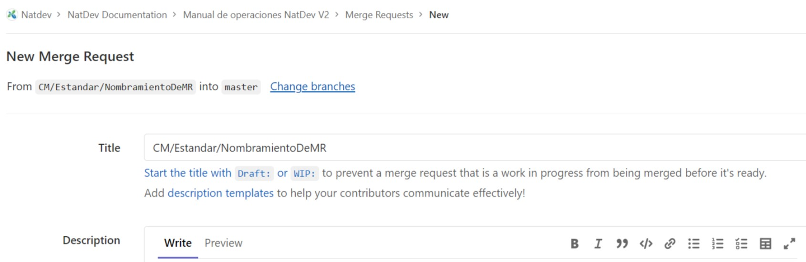

# Estándar de nombramiento de Merge Request (MR)
## Versión

1.0.0

## Objetivos

- Homogeneizar el nombramiento de los Merge Requests en el controlador de versiones (Github).

## Descripción del estándar

- Copiar el nombre de la rama en el título del MR. Este nombre debe seguir el [estándar definido.](./RamasDeControlDeVersiones.md)

## Ejemplos del estándar

- CAP/Feature/US13
- CAP/Fix/ProspectSecondSurname
- CAP/Estandar/NombramientoDeMR (**Figura 1**)
- CAP/Proceso/Inception

Ejemplo de título de MR

