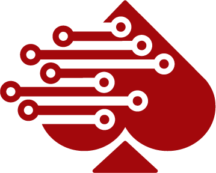

# ¡Bienvenid@ a la Wiki de ACE Technology!

## Información general
### ACE
En el mundo del tenis se conoce un *ACE* como un tiro tan perfecto que el oponente no puede ni tocar la pelota. Nosotros estamos enfocados a ser ese tiro en la industria del software. 

Brindamos a nuestros clientes software de alta calidad, enfocandonos siempre en su necesidad. Nuestro enfoque se centra en dar la solución correcta de la forma correcta, esto quiere decir que cada proyecto será analizado y desarrollado con una visión única, aprovechando las metodologías que se acomoden mejor a sus necesidades. 

### Misión 
Proveer soluciones escalables, eficientes y de calidad a problemáticas empresariales mediante el desarrollo de software. 

### Visión 
Ser el departamento líder en el desarrollo de soluciones de software para empresas y organizaciones.

### Valores
*   **Compromiso** con las necesidades de nuestros clientes
*   **Respeto** hacia nuestros socios, clientes e integrantes 
*   **Integridad** durante todo el proceso de desarrollo 
*   **Empatía** con nuestros clientes y sus necesidades
*   **Trabajo en equipo**, tanto interno como externo

### Objetivos
1.  Entregar los proyectos administrados por ACE en costo, alcance y calidad para que satisfagan las necesidades de los socios y así se cumplan los objetivos acordados al terminar el semestre febrero Junio 2022.
2.  Llegar a un nivel 3 en el CMMI durante el tercer periodo del semestre.
3.  Formar un ambiente de trabajo que propicie motivación y confianza en el departamento

## Equipo ACE
#### Program managers:
*   Adriana Millares Forno
*   Cutberto Arizabalo Nava

#### Equipos de ACE
*   [⚜️ Flor Imperial](../FlorImperial/README.md)
*   [❤️🏠 Full House](../FullHouse/README.md)
*   [♠️ BlackJack](../BlackJack/README.md)

#### El trabajo del departamento se apoya en los siguientes marcos de referencia:
*   Disciplined Agile Delivery
*   CMMI for development
*   PMBoK

## Forma de trabajo:
Cada equipo dentro del departamento deberá de gestionar su propio trabajo y deberá definir los siguientes puntos:

*   Roles.
*   Horarios de trabajo.
*   Guías, plantillas y otros documentos de apoyo.
*   Procesos.

En caso de que todos los equipos adquieran una práctica, esta se volverá una práctica departamental. Las practicas departamentales deben ser seguidas por cada equipo. En caso de ser modificadas por estos cambios deberán ser documentados y publicados en la Wiki del equipo que realizó los cambios.

## Ciclo de vida 
El departamento de ACE y todos sus equipos seguirán el ciclo de vida básico de DAD.

## WBS
[Consulta nuestro WBS](./img/WBS_Departamental.svg)

## Agradecimientos
Gracias a todos los departamentos anteriores a ACE por brindarnos su conocimiento por medio de la documentación de sus wikis, así como heredar prácticas sanas para la consolidación de un departamento de TI.

*   [Nova](https://github.com/novaDepto/Nova/wiki)
*   [Impulse](https://impulse-semestrei.github.io/)
*   [Blink](https://bitbucket.org/KaryRs/blink_wiki/wiki/Home)
*   [Percept](https://github.com/97joaquinhr/Percept/wiki)
*   [CaveLabs](https://github.com/97joaquinhr/Percept/wiki)
*   [Solify](https://github.com/Solify-IT/docs/wiki)
*   [Taro](https://taro-it.github.io/docs/)